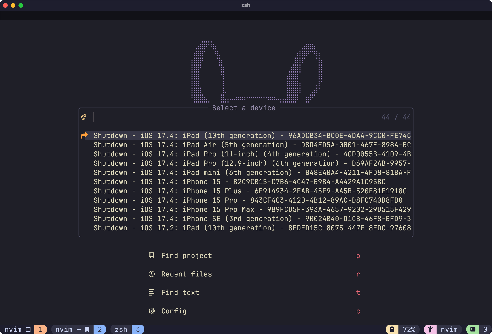

# simctl.nvim

## 📱 ➕ ⌨️ 🟰 🚀

NeoVim plugin to interact with iOS Simulators straight from the comfort of your editor. It provides a lua API for `simctl`, Apple's command line tool.

Have you ever found yourself context switching all the time when you are developing against the iOS Simulator? Tired of having to use the mouse to quit apps, going through the tedious two-three click process of deleting apps before trying a fresh install or having to do other manual steps every time you run your app in development? This plugin is for you!

## Installation

Mac OS and Xcode are required. Make sure `xcrun` is available in your terminal.

Using Lazy:

```lua
{
  "terje/simctl.nvim",
  dependencies = {
    "nvim-lua/plenary.nvim",
  },
}
```

There is no need to call setup if you are ok with the defaults

```lua
require("simctl").setup({
  notify = true, -- enable error notifications
  devicePicker = true, -- show the device picker if no deviceId is supplied
  appPicker = true, -- show the app picker if no appId is supplied
})
```

## Features - a bird's-eye view

The provided Lua API provides coverage of any `simctl` functions that might be most useful from NeoVim, such as launching and terminating apps, booting and shutting down devices, erasing devices and setting UI options.



The API presents pickers for devices and apps if none are supplied, so most of the API functions can be called without arguments for interactive use, for instance: `require("simctl.api").launch()`

There is also support for testing push notifications, either through the API function, or directly from an .apns or .json file using the `SimctlNotify` command.

See the [Wiki](https://github.com/terje/simctl.nvim/wiki) for more example usages, for instance with [Expo](https://github.com/terje/simctl.nvim/wiki/Example-Expo-setup), and some example [key mappings](https://github.com/terje/simctl.nvim/wiki/Key-mapping-example).

## Push notifications

The `SimctlNotify` command is automatically registered for `.json` and `.apns` files. The same action is registered for both, although the convention is for plain json files to only include the notification payload and the `.apns` file to include an additional `"Simulator Target Bundle"` indicating the app bundle ID to target:

```json
{
    "Simulator Target Bundle": "com.test.MyNotifiedApp",
    "aps": {
        "alert": {
            "title": "NeoVim says hello",
            "body": "Your favourite editor sends its greetings"
        }
    }
}
```

Run the command `:SimctlNotify` or assign this to your keymap for quick access to send this notification to a booted device. The command takes two optional arguments, a deviceId and an app bundle ID.

## Available API functions

```lua
local simctl = require("simctl.api")

simctl.boot()
simctl.erase()
simctl.launch()
simctl.list()
simctl.listapps()
simctl.openurl()
simctl.push()
simctl.shutdown()
simctl.statusbar()
simctl.terminate()
simctl.ui.contentSize()
simctl.ui.setContentSize()
simctl.ui.increaseContentSize()
simctl.ui.decreaseContentSize()
simctl.ui.appearance()
simctl.ui.setAppearance()
simctl.ui.toggleAppearance()
simctl.ui.increaseContrast()

local pickers = require("simctl.lib.pickers")
pickers.pickApp()
pickers.pickDevice()
```

Add any of these to your keymap for easy access:
```lua
vim.keymap.set("n", "<leader>ib", function()
require("simctl.api").boot()
end)
```

## API Usage

All API functions take two optional arguments, `args` and `callback`.

Args is used to pass options to the function, and callback returns the result since all functions are asynchronous so as to not block the UI. Here's an example:

```lua
local args = {
  deviceId = "FE4BD15E-C65C-45DB-960A-78A771B16D17",
  appId = "host.exp.Exponent"
}

require("simctl.api").launch(args)
```

The API is designed to be as forgiving as possible, and will present UI pickers for required options that weren't supplied, for instance a deviceId.

The deviceId `booted` is a special ID that picks one of the booted simulators at random. Useful if you only have one booted or don't care which simulator runs your command.

Functions that are expected to return a result do so through a callback. Here's an example:

```lua
local simctl = require("simctl.api")

local args = {
  deviceId = "FE4BD15E-C65C-45DB-960A-78A771B16D17"
  appType = simctl.AppType.User
}

simctl.listapps(args, function(success, apps, stdout, stderr)
  print(vim.inspect(apps))
end)
```

### Boot (start) device

```lua
local args = {
    deviceId = "FE4BD15E-C65C-45DB-960A-78A771B16D17" -- Device ID. Required
}

local callback = function(success, _, stdout, stderr)
end

require("simctl.api").boot(args, callback)
```

### Erase (reset) device

```lua
local args = {
    deviceId = "FE4BD15E-C65C-45DB-960A-78A771B16D17" -- Device ID. Required. Can be "all" for all devices.
}

local callback = function(success, _, stdout, stderr)
end

require("simctl.api").erase(args, callback)
```

### Launch app

```lua
local args = {
    appId = "host.exp.Exponent", -- The app to launch. Required
    deviceId = "FE4BD15E-C65C-45DB-960A-78A771B16D17" -- Device ID. Optional, will pick a running simulator if not supplied ("booted").
}

local callback = function(success, _, stdout, stderr)
end

require("simctl.api").launch(args, callback)
```

### List available devices

```lua
local callback = function(success, devices, stdout, stderr)
end

require("simctl.api").list(callback)
```

### List installed apps

```lua
local simctl = require("simctl.api")

local args = {
    deviceId = "FE4BD15E-C65C-45DB-960A-78A771B16D17" -- Device ID. Optional, will pick a running simulator if not supplied ("booted").
    appType = simctl.AppType.User -- Optional. Returns all apps if not filtered
}

local callback = function(success, apps, stdout, stderr)
end

simctl.listapps(args, callback)
```

### Open URL

```lua

local args = {
    deviceId = "FE4BD15E-C65C-45DB-960A-78A771B16D17" -- Device ID. Optional, will pick a running simulator if not supplied ("booted").
    url = "https://soundthesea.com" -- The URL to open. Required
}

local callback = function(success, _, stdout, stderr)
end

require("simctl.api").openurl(args, callback)
```

### Send a push notification

```lua
local args = {
    appId = "com.test.MyNotifiedApp" -- App bundle ID. Required.
    deviceId = "FE4BD15E-C65C-45DB-960A-78A771B16D17" -- Device ID. Optional, will pick a running simulator if not supplied ("booted").
    payload = "[JSON]" -- The json payload of the push message (see format above in the SimctlNotify documentation)
}

require("simctl.api").push(args)
```


### Shut down device

```lua
local args = {
    deviceId = "FE4BD15E-C65C-45DB-960A-78A771B16D17" -- Device ID. Required. Can also be "all" to shut down all running devices.
}

local callback = function(success, _, stdout, stderr)
end

require("simctl.api").shutdown(args, callback)
```

Simulators cannot be erased in their Booted state so they have to be shut down first:

```lua
local simctl = require("simctl.api")
local device = { deviceId = "FE4BD15E-C65C-45DB-960A-78A771B16D17" }
simctl.shutdown(device, function(success)
  if success then
    simctl.erase(device, function(success)
        -- Next step of your dev workflow?
    end)
  end
end)
```

### Status bar

#### Set status bar values

```lua
local simctl = require("simctl.api")

simctl.statusbar({
    [simctl.StatusbarFlag.BATTERY_LEVEL] = 50,
    [simctl.StatusbarFlag.TIME] = "09:41"
})
```

#### Clear status bar overrides

```lua
local simctl = require("simctl.api")

simctl.statusBar({ clear = true })
```

#### Get current status bar overrides

```lua
local simctl = require("simctl.api")

simctl.statusBar({}, function(success, result)
    print(result)
end)
```

Note: This API returns just text at the moment and is liable to change into a parsed version

### Terminate app

```lua
local args = {
    appId = "host.exp.Exponent", -- The app to terminate. Required
    deviceId = "FE4BD15E-C65C-45DB-960A-78A771B16D17" -- Device ID. Optional, will pick a running simulator if not supplied ("booted").
}

local callback = function(success, _, stdout, stderr)
end

require("simctl.api").terminate(args, callback)
```

### Set UI options

```lua
local simctl = require("simctl.api")

-- Return current content size
simctl.ui.contentSize({}, function(success, contentSize)
    print(contentSize)
end)

-- Set content size to accessibility-large
simctl.ui.setContentSize({ size = simctl.ui.ContentSize.ACCESSIBILITY_LARGE })

-- Increment content size
simctl.ui.setContentSize({ size = simctl.ui.ContentSizeModifier.INCREMENT })

-- Return current appearance
simctl.ui.appearance({}, function(success, appearance)
    print(appearance)
end)

-- Set appearance to dark
simctl.ui.setAppearance({ appearance = simctl.ui.Appearance.DARK })

-- Toggle appearance between light and dark
simctl.ui.toggleAppearance()

-- Return current contrast mode
simctl.ui.increaseContrast({}, function(success, enabled)
    print("High contrast is " .. tostring(enabled))
end)

-- Set increased contrast
simctl.ui.increaseContrast({ enabled = true })
```

### Uninstall app

```lua
local args = {
    appId = "host.exp.Exponent", -- The app to terminate. Required
    deviceId = "FE4BD15E-C65C-45DB-960A-78A771B16D17" -- Device ID. Optional, will pick a running simulator if not supplied ("booted").
}

local callback = function(success, _, stdout, stderr)
end

require("simctl.api").uninstall(args, callback)
```
